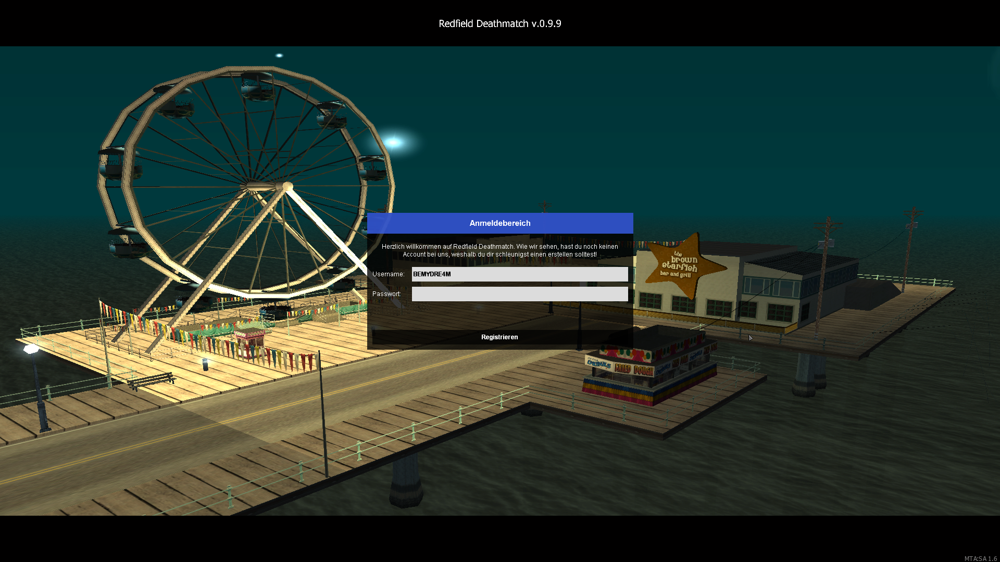
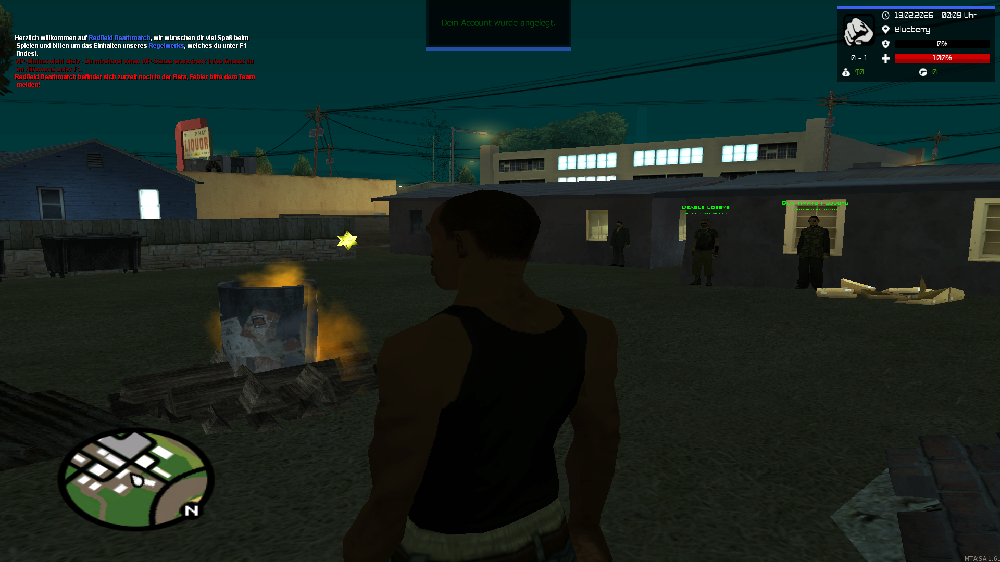
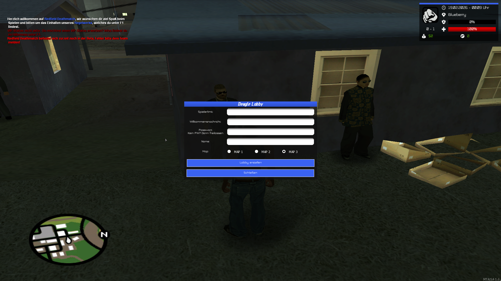
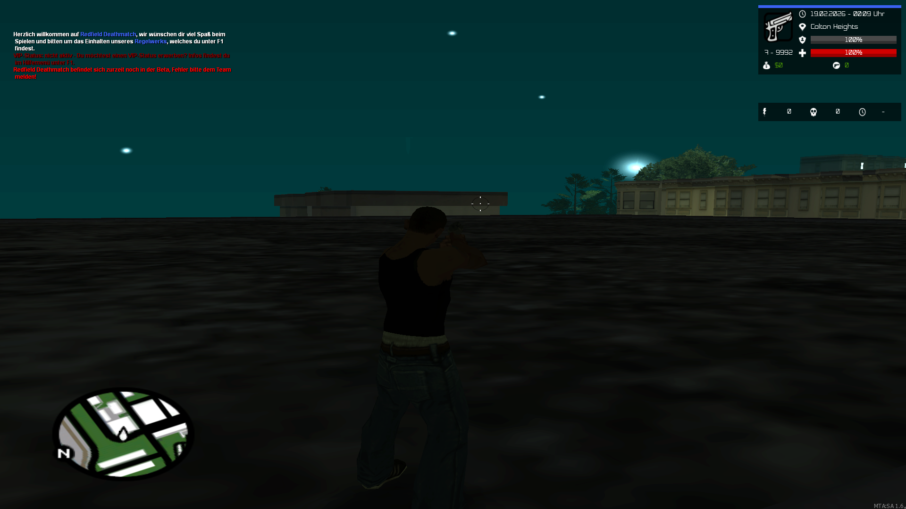
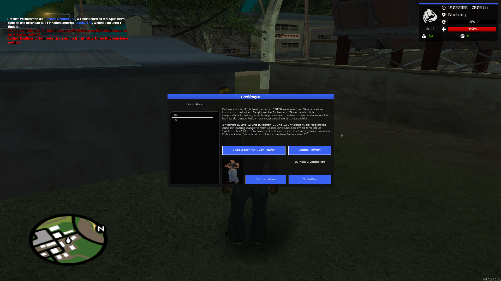
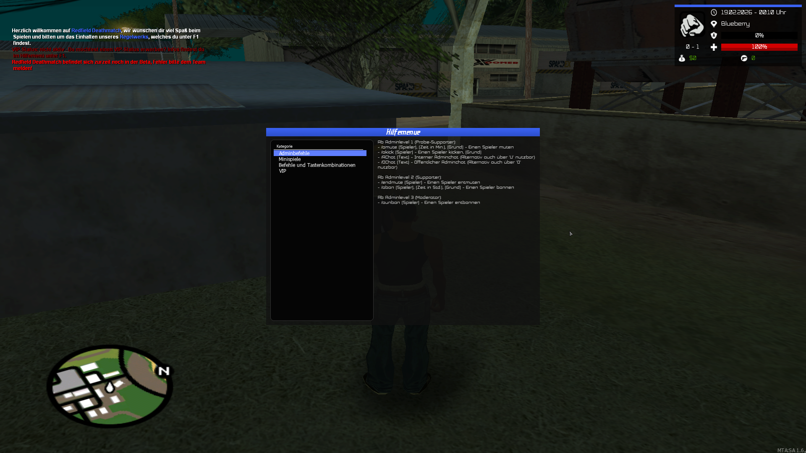
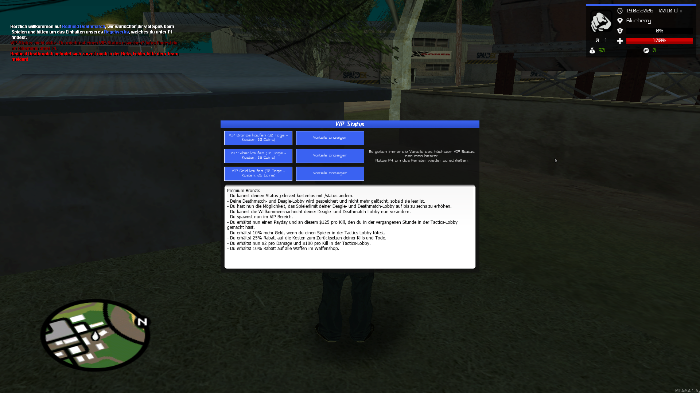
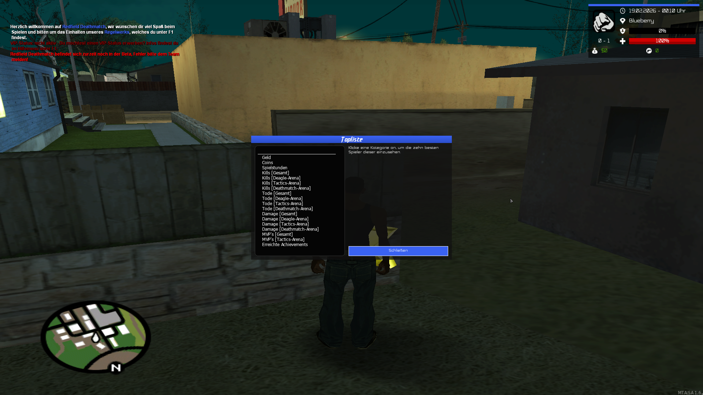
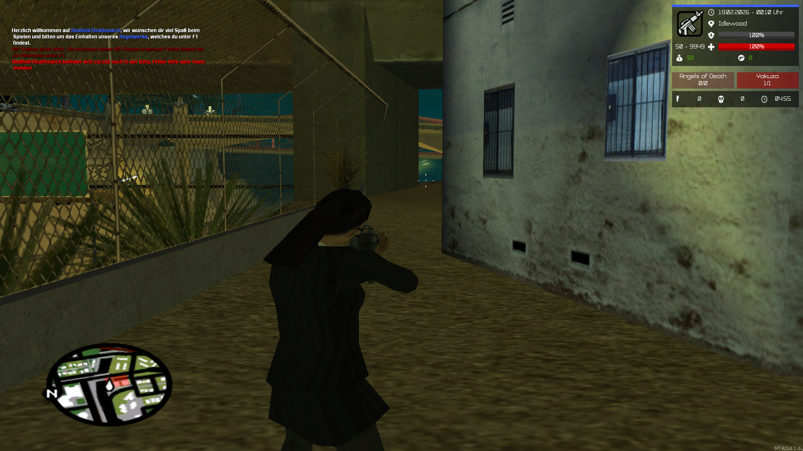

# Redfield-Deathmatch

Redfield Deathmatch is a deathmatch PvP game mode that was developed in 2018. It includes lobbies (team vs team, free-for-all [only Deagle mode or Deagle/M4/MP5/rifle mode]), the ability to create your own lobbies and save them with VIP status, a leaderboard, collecting coins, and opening skin boxes.

|Category|Amount|
|---|---|
|LUA files|37|
|other files|367|
|functions|256|
|lines|3907|
|characters|183383|
|comment-lines|178|
|comment-characters|3555|

### Gameplay and Screenshots
* https://youtu.be/1HbyP3JzqlQ

  
  
     
  
  
     
  
  
     
  
  

